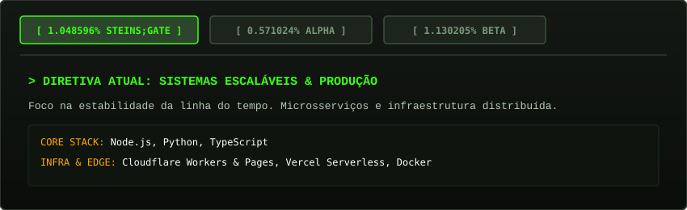

  

 

<table>
  <tr>
    <td width="65%" valign="top">
      <h3>📟 Transmissão Inicial</h3>
      

        Engenheiro de Software focado em construir sistemas escaláveis e ferramentas analíticas. 
        Explorando arquiteturas distribuídas, microsserviços e computação na borda.
      

      

        Atualmente iterando entre diferentes camadas de abstração para decifrar a linha do tempo ideal.
      

      

        
        
        
      

    </td>
    <td width="35%" align="center" valign="middle">
      
    </td>
  </tr>
</table>

---

### ⏱️ Seletor de Linha do Tempo (World Lines)

---

### 📱 Future Gadget Lab - Transmissão de D-Mail

Envie uma mensagem curta que atravessará o canal temporal do repositório:
