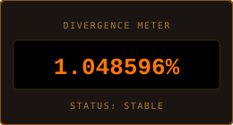

  

 

<table>
  <tr>
    <td width="65%" valign="top">
      <h3>📟 Transmissão Inicial</h3>
      

        Engenheiro de Software focado em construir sistemas escaláveis e ferramentas analíticas. 
        Explorando arquiteturas distribuídas, microsserviços e computação na borda.
      

      

        Atualmente iterando entre diferentes camadas de abstração para decifrar a linha do tempo ideal.
      

      

        
        
        
      

    </td>
    <td width="35%" align="center" valign="middle">
      
    </td>
  </tr>
</table>

---

### ⏱️ Seletor de Linha do Tempo (World Lines)

  
<b>[ Linha 1.048596% - Steins;Gate (Stack & Produção) ]</b>

   
  <blockquote>
    <b>Diretiva Atual:</b> Construção de aplicações modernas, APIs desacopladas e microsserviços de alta disponibilidade.
  </blockquote>
  <ul>
    <li><b>Backend:</b> Node.js, Python, Serverless Functions</li>
    <li><b>Cloud / Edge:</b> Vercel, Cloudflare Workers & Pages</li>
    <li><b>Bancos de Dados:</b> PostgreSQL, Redis</li>
  </ul>

  
<b>[ Linha 0.571024% - Alpha (Sistemas & Baixo Nível) ]</b>

   
  <blockquote>
    <b>Ambiente Experimental:</b> Onde scripts de automação, manipulação direta de hardware e protocolos seriais residem.
  </blockquote>
  <ul>
    <li>Automação de workflows e rotinas de deploy</li>
    <li>Comunicação serial, microcontroladores e dispositivos embarcados</li>
    <li>Otimização de pipelines no GitHub Actions</li>
  </ul>

  
<b>[ Linha 1.130205% - Beta (Algoritmos & Computação Analítica) ]</b>

   
  <blockquote>
    <b>Ambiente Teórico:</b> Foco em análise matemática, modelagem e resolução algorítmica.
  </blockquote>
  <ul>
    <li>Simulações estatísticas e processamento de dados brutos</li>
    <li>Modelagem física e computação científica</li>
    <li>Estruturas de dados complexas e otimização de consultas</li>
  </ul>

---

### 📱 Future Gadget Lab - Transmissão de D-Mail

Envie uma mensagem curta que atravessará o canal temporal do repositório:
