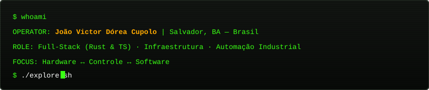
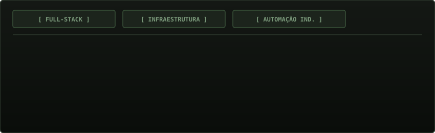

  

 

### 👨‍💻 Sobre

Engenheiro de Automação em formação, com base técnica dupla em Automação Industrial (IFBA) e Engenharia de Computação (Unijorge). Atuo na interseção entre hardware, controle e software.

Experiência com microcontroladores (Arduino, ESP32), programação embarcada em C/C++ e Rust, protocolos industriais (HART, FieldBus, Modbus) e infraestrutura virtualizada em produção.

---

### 💼 Experiências

**Estagiário — Tribunal de Justiça da Bahia** `Ago/2026 – Atual`
Desenvolvimento de soluções com a plataforma Microsoft Power: automação de fluxos com **Power Automate**, criação de aplicativos internos com **Power Apps** e construção de dashboards analíticos com **Power BI**.

**Estagiário de Suporte — Provide IT · Wall Street Empresarial** `Dez/2025 – Atual`
Administração de infraestrutura virtualizada (VMware, Hyper-V) em ambiente multi-cliente. Monitoramento proativo de servidores Windows Server e SQL Server em Azure. Rotinas de backup e recuperação com Veeam, ArcServe e Backup Exec.

**Gestor do Núcleo de Inovação — NITE · Unijorge** `Atual`
Administração de cluster Proxmox com 3 nós (alta disponibilidade, failover, VLANs). Coordenação de equipe em projetos para a universidade e parceiros externos, incluindo o sistema **SOS Sotero** em produção.

**Estagiário de Suporte Técnico — Polisystem · Hangar Business Park** `Mai/2025 – Nov/2025`
Suporte em ambientes Windows e redes locais, com diagnóstico sistemático de falhas de hardware, software e conectividade em ambiente de produção.

**Aluno-a-Oficial — Exército Brasileiro · 19º Batalhão de Caçadores** `Fev/2024 – Dez/2024`
Formação militar de dez meses, consolidando disciplina operacional, responsabilidade técnica e capacidade de atuação sob pressão.

---

### 🛠️ Tecnologias

  
  
  
  
  
  
  
  

---

### 🖥️ Stack & Áreas de Atuação

---

  
  

